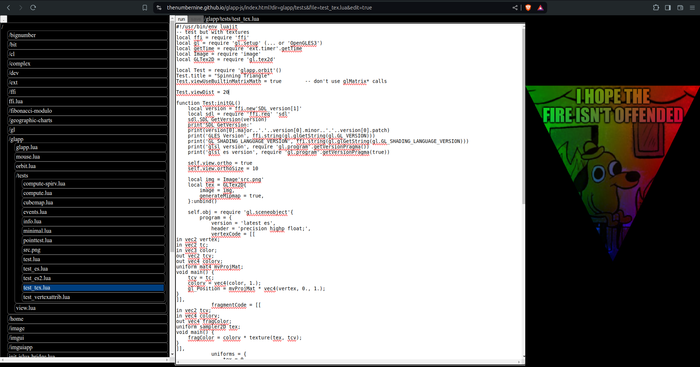

 

# LuaJIT + OpenGL + SDL in Browser

-	[[interactive editor]](https://thenumbernine.github.io/glapp/)

-	[[launch]](https://thenumbernine.github.io/glapp/?dir=glapp/tests&file=test_es.lua)
	[[source]](https://thenumbernine.github.io/lua/glapp/tests/test_es.lua)
	polygon demo
-	[[launch]](https://thenumbernine.github.io/glapp/?dir=glapp/tests&file=test_tex.lua)
	[[source]](https://thenumbernine.github.io/lua/glapp/tests/test_tex.lua)
	texture demo

This tool runs LuaJIT + SDL + OpenGL + ImGui code in browser.

The LuaJIT is "emulated" via vanilla-Lua + lua-FFI , compiled to wasm, which is built via my [lua-ffi-wasm](http://github.com/thenumbernine/lua-ffi-wasm) project.

The FFI, SDL, and ImGui calls are handled via a shim layer.

FFI is all handled with a pure-Lua implementation all up to the byte allocation, which is handed off to JS.  In theory you could swap that out and use the `ffi.lua` file in any vanilla Lua environment where you want to emulate luajit.

The `ffi/OpenGLES3.lua` file is an interface layer between GLES and WebGL.

The `main.js` and `ffi/sdl.lua` files handle the canvas object and the Lua wrapping thread to allow for my internal SDL busy-loops to become interval loops in browser.

# Why?

The native LuaJIT version is fast, and always runs at least twice or more as fast as a browser+JS+WebGL-equivalent app.
Too bad the modern standard browser platform sucks so much, and is so slow.
I'm only making this for compatability's sake, not as a primary deployment option.  To share with normies who only know how to open browser windows but who can't download binaries.

# Code Editor

I'm using [Ace](https://github.com/ajaxorg/ace) for the code editor.  No complaints at all, integrating and using it is flawless.

# Last

- Also I'm using [Pako](https://github.com/nodeca/pako) for zlib support.

- TODO maybe - pause button <-> pause the setinterval for the main event loop.
