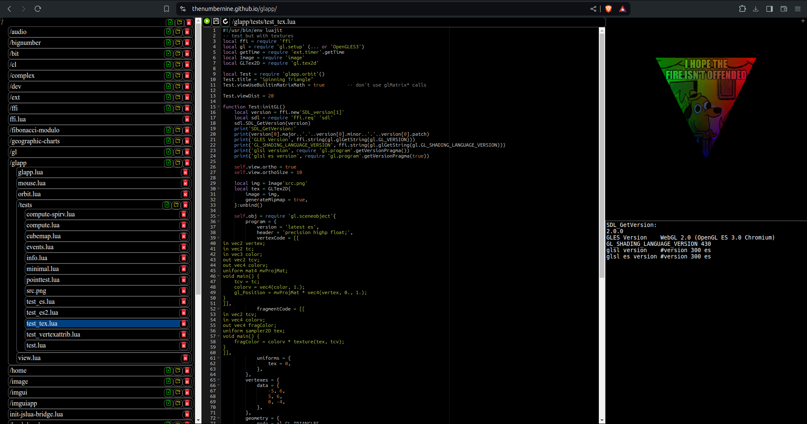

 

# LuaJIT + OpenGL + SDL in Browser

-	[[interactive editor]](https://thenumbernine.github.io/glapp/)

-	[[launch]](https://thenumbernine.github.io/glapp/?dir=glapp/tests&file=test_es.lua)
	[[source]](https://thenumbernine.github.io/lua/glapp/tests/test_es.lua)
	polygon demo
-	[[launch]](https://thenumbernine.github.io/glapp/?dir=glapp/tests&file=test_tex.lua)
	[[source]](https://thenumbernine.github.io/lua/glapp/tests/test_tex.lua)
	texture demo

This tool runs LuaJIT + SDL + OpenGL + ImGui code in browser.

The Lua is handled by one of a few Lua/JS backends.

The FFI, SDL, and ImGui calls are handled via a shim layer.

FFI is all handled with a pure-Lua implementation all up to the byte allocation, which is handed off to JS.  In theory you could swap that out and use the `ffi.lua` file in any vanilla Lua environment where you want to emulate luajit.

Maybe in the future I'll use an Emscripten-compiled luajit-compatible Lua ffi library.  There are a few floating around, but every one that I used on my own LuaJIT code I got an immediate segfault and turned back.

The `ffi/OpenGLES3.lua` file is an interface layer between GLES and WebGL.

The `main.js` and `ffi/sdl.lua` files handle the canvas object and the Lua wrapping thread to allow for my internal SDL busy-loops to become interval loops in browser.

# Why?

Since the FFI code is emulated the whole thing goes slow af.  Why would I make such an abomination?  Because the LuaJIT native version is fast af, and always runs at least twice or more as fast as a browser+JS+WebGL-equivalent app.
Too bad the modern standard browser platform sucks so much, and is so slow.
I'm only making this for compatability's sake, not as a primary deployment option.

# Code Editor

I'm using [Ace](https://github.com/ajaxorg/ace) for the code editor.  No complaints at all, integrating and using it is flawless.

# Lua/JS

I'm going through different Lua/JS libraries to see which works best.

- Fengari
	- JS interop is flawless.
	- Sadly it is missing filesystem support.  Since it is not Emscripten-compiled, it does not come with Emscripten's filesystem library.
	- There's no `__gc` overloading since JS handles the object lifespan (at least I think that's why).  Sadly my Lua GL library frees resources upon `__gc`, so that means GL resources won't get automatically freed.  Neither will FFI memory ... so better not leak anything!

- Wasmoon
	- ...is Emscripten-compiled and so you do get Emscripten's filesystem for free, however everything Wasmoon itself brings to the table makes things more difficult.
	- The Wasmoon wrapping filesystem calls are all in TEXT, not BINARY, so I have to side-step them.
	- Overriding Emscripten's print and printErr is straightforward without Wasmoon ... but is a pain to do with it (haven't figured out how yet)
	- The Wasmoon interop functions are full of holes.
		- There's strange cases where my own classes and objects will be passed through fine, but builtin functions like `ArrayBuffer` when passed through will get extra crap wrapped around them.
		- Lua calls to JS code will detect different objects every time for the same Lua object (or for the same original JS object even),
		- Wasmoon doesn't give any meaningful errors in Lua, just "Error: Error".  So all my lua code entry points need to be wrapped in xpcall's.
		- Wasmoon doesn't give any meaningful errors in JS code called by Lua, just something about `TypeError: Cannot read properties of null (reading 'then')`, so all Lua-to-JS calls need to be wrapped in try/catch blocks.
		- Wasmoon Lua-to-JS calls cannot `await`.

- Other contenders?
	- https://github.com/Doridian/LuaJS

